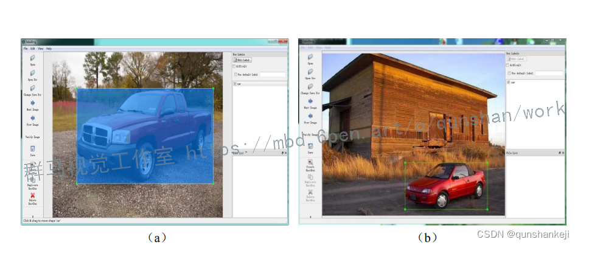
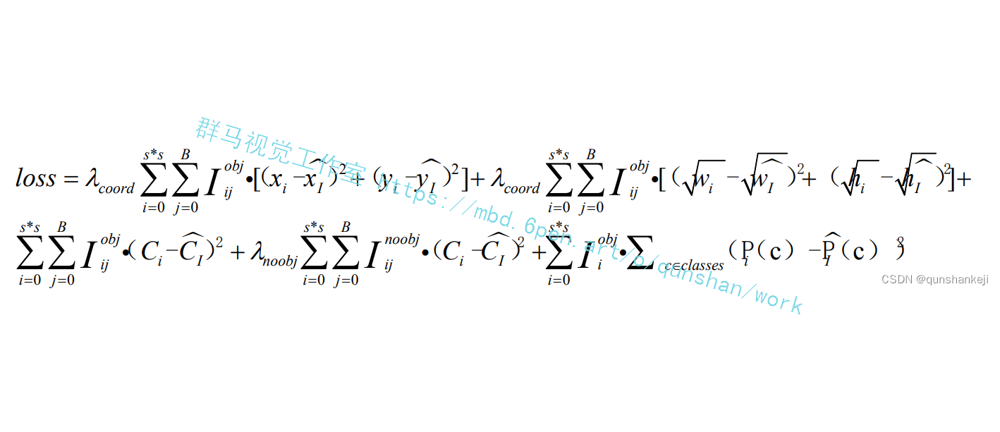
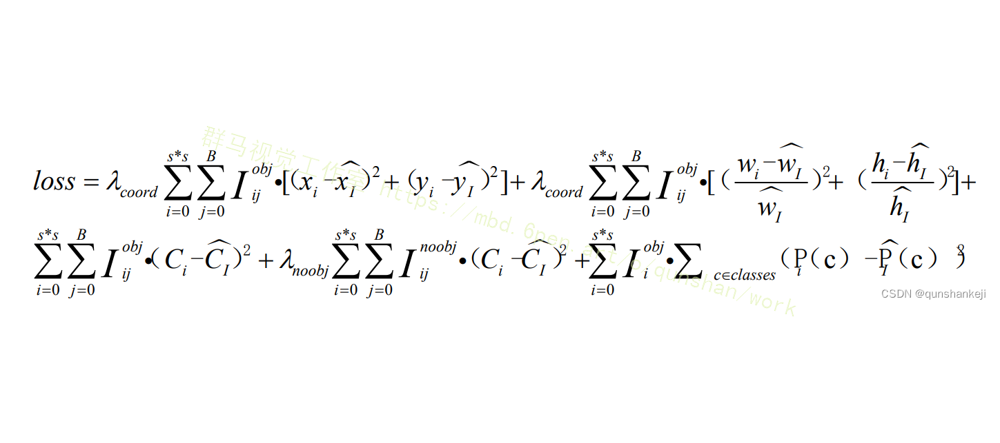

# 1.项目背景与意义


随着城市化进程的加快和交通工具的普及，车辆数量的快速增长给城市交通管理带来了巨大的挑战。车流量检测是交通管理的重要组成部分，它可以提供实时的交通状况信息，帮助交通管理部门制定合理的交通策略，优化交通流量，提高道路利用效率，减少交通拥堵和事故发生的可能性。

传统的车流量检测方法主要依赖于传感器设备，如地磁传感器、红外线传感器等，这些传感器需要在道路上布设，成本较高且安装维护困难。而基于计算机视觉的车流量检测系统则可以通过分析道路上的摄像头图像来实现，具有成本低、安装方便、实时性强等优势。

OpenCV是一个开源的计算机视觉库，提供了丰富的图像处理和计算机视觉算法，可以用于车流量检测系统中的图像处理和分析。Yolov5是一个基于深度学习的目标检测算法，具有高准确率和实时性的特点，可以用于车辆的检测和跟踪。

# 2.图片演示


# 3.视频演示

# 4.系统流程步骤

基于OpenCV和Yolov5的车流量检测系统可以通过以下步骤实现：

1. 图像采集：使用摄像头采集道路上的车辆图像。

2. 图像预处理：使用OpenCV对采集到的图像进行预处理，包括图像去噪、图像增强等。

3. 车辆检测：使用Yolov5对预处理后的图像进行车辆检测，识别出图像中的车辆。

4. 车辆跟踪：根据检测到的车辆，使用OpenCV进行车辆的跟踪，追踪车辆在不同帧之间的位置和运动轨迹。

5. 车流量统计：根据车辆的跟踪结果，统计道路上的车流量，包括车辆的数量、车辆的速度等。


# 5.算法优点
基于OpenCV和Yolov5的车流量检测系统具有以下优势和意义：

1. 高准确率：Yolov5作为一种先进的目标检测算法，具有较高的准确率，可以准确地检测和识别道路上的车辆。

2. 实时性强：Yolov5算法的实时性较好，可以在较短的时间内完成车辆的检测和跟踪，实时更新车流量信息。

3. 成本低：相比传统的车流量检测方法，基于OpenCV和Yolov5的系统不需要额外的传感器设备，只需要使用摄像头即可实现车流量检测，成本较低。

4. 安装方便：基于OpenCV和Yolov5的系统只需要在道路上布设摄像头，安装和维护较为方便。

5. 实用性强：车流量检测系统可以为交通管理部门提供实时的交通状况信息，帮助制定合理的交通策略，优化交通流量，提高道路利用效率，减少交通拥堵和事故发生的可能性。

综上所述，基于OpenCV和Yolov5的车流量检测系统具有重要的研究意义和实际应用价值，可以为城市交通管理提供有效的技术支持，促进交通运输的安全、高效和可持续发展。

# 6.数据集的制作
在车流量统计中只需要识别道路中的车辆，因此在制作数据集时只选取车辆一种类别，其他非车辆物体作为负样本，包含车辆的正样本有8000个，负样本包含行人、飞机、船等共3000个。
车辆识别数据集制作首先运用图像标注软件对车辆进行标注，并将所标注的信息生成相对应的xml文件，xml文件包含图片名称、图片路径、目标标签名称及目标位置坐标，车辆标注过程如图3.18所示。包含标注信息的xml文件不能直接用来训练YOLO网络，需要将xml文件转换成YOLO支持的txt文件。标注完所有图片后，将原图及生成的所有文件按照VOC数据文件结构存放，以供训练车辆识别模型使用。

# 7.网络模型优化
YOLO网络采用均方误差(mean squared error）作为损失函数，这种损失函数的设计形式对优化模型参数非常有利。为了更好地训练网络模型，YOLO网络在反向传播的过程中，其损失函数共包含三部分内容:
(1）标注数据与网格预测坐标之间的误差（coordError) ;
(2)目标的预测边界框与真实边界框之间的交集与并集的比值误差( iouError) ;(3）目标的分类误差(classError）。
YOLO的损失函数如下:

(w，y)表示网络预测目标框的宽和高;(w,，h, )表示标签中目标框的宽和高;C表示网络预测目标时计算的置信度分数;己,表示网络设置的置信度分数;P(c)表示网络预测的目标属于某一类别的概率;(c)表示目标真实类别的概率;参数⒉ora的引入是为了增强边界框在损失计算中的重要性。
能够减弱非目标区域对目标区域置信度计算的影响，Aoobj =0.5;I表示图像中第i个图像块有目标，TW表示在第i个图像块的第i个预测框中有目标，若无目标刷头noobj在预测目标的边界框时，预测结果对大目标和小目标的影响是相同的，然而真实情况是大目标的敏感性小于小目标，当边界框的宽和高(w,h）发生略微变化时，小目标的边界框就会消失，因此，YOLO网络采用平方根处理边界框的宽和高(w,h)，这种对边界框的处理方式虽然能够使得大目标与小目标的敏感性接近一致，但是没有考虑到物体尺寸存在差异时对整体误差的影响不同，交通视频中往往车型较多，YOLO网络损失函数对大车和小车的预测边界框采用统一的误差，这与真实情况不符，为了体现出不同尺寸的车辆产生的误差在整个网络中所占的比重不同，本文采用比值的方式对损失函数进行优化，运用( w;-w, / ,,h,-h， / h，)代替原损失函数的（w,-w,，(h,-Vh,)，这样不但可以提升网络预测物体类别的能力，也可以优化目标边框的位置。优化后的损失函数如式所示:


# 8.核心代码讲解

#### 8.1 detector_CPU.py

```python

class Detector:
    def __init__(self):
        self.img_size = 640
        self.threshold = 0.1
        self.stride = 1

        self.weights = './weights/output_of_small_target_detection.pt'

        self.device = '0' if torch.cuda.is_available() else 'cpu'
        self.device = select_device(self.device)
        model = attempt_load(self.weights, map_location=self.device)
        model.to(self.device).eval()
        model.float()

        self.m = model
        self.names = model.module.names if hasattr(
            model, 'module') else model.names

    def preprocess(self, img):
        img0 = img.copy()
        img = letterbox(img, new_shape=self.img_size)[0]
        img = img[:, :, ::-1].transpose(2, 0, 1)
        img = np.ascontiguousarray(img)
        img = torch.from_numpy(img).to(self.device)
        img = img.float()
        img /= 255.0
        if img.ndimension() == 3:
            img = img.unsqueeze(0)

        return img0, img

    def detect(self, im):
        im0, img = self.preprocess(im)

        pred = self.m(img, augment=False)[0]
        pred = pred.float()
        pred = non_max_suppression(pred, self.threshold, 0.4)

        boxes = []
        for det in pred:
            if det is not None and len(det):
                det[:, :4] = scale_coords(
                    img.shape[2:], det[:, :4], im0.shape).round()

                for *x, conf, cls_id in det:
                    lbl = self.names[int(cls_id)]
                    if lbl not in ['car','bus','truck']:
                        continue
                    x1, y1 = int(x[0]), int(x[1])
                    x2, y2 = int(x[2]), int(x[3])

                    xm = x2
                    ym = y2
                    boxes.append((x1, y1, x2, y2, lbl, conf))

        return boxes
```
封装的类名为`Detector`，包含以下方法：
- `__init__`：初始化模型和参数
- `preprocess`：预处理图像
- `detect`：检测目标并返回检测结果

这个程序文件名为detector_CPU.py，它是一个目标检测器的类。该类具有以下属性和方法：

属性：
- img_size：图像的尺寸，默认为640
- threshold：目标检测的置信度阈值，默认为0.1
- stride：步长，默认为1
- weights：模型的权重文件路径，默认为'./weights/output_of_small_target_detection.pt'
- device：设备类型，如果有GPU则为'0'，否则为'cpu'
- m：加载的模型
- names：目标类别的名称列表

方法：
- __init__(self)：初始化方法，加载模型并设置相关参数
- preprocess(self, img)：预处理方法，将输入图像进行尺寸调整、通道转换等操作，返回原始图像和处理后的图像
- detect(self, im)：目标检测方法，对输入图像进行目标检测，返回检测到的目标框的列表

在detect方法中，首先调用preprocess方法对输入图像进行预处理。然后使用加载的模型对处理后的图像进行目标检测，得到预测结果。接着对预测结果进行非最大抑制，去除重叠的目标框。最后，遍历每个检测到的目标框，筛选出类别为'car'、'bus'和'truck'的目标框，并将其添加到结果列表中。最终返回结果列表。

#### 8.2 detector_GPU.py

```python

class Detector:
    def __init__(self):
        self.img_size = 640
        self.threshold = 0.1
        self.stride = 1
        self.weights = './weights/Attention_mechanism.pt'
        self.device = '0' if torch.cuda.is_available() else 'cpu'
        self.device = select_device(self.device)
        model = attempt_load(self.weights, map_location=self.device)
        model.to(self.device).eval()
        model.half()
        self.m = model
        self.names = model.module.names if hasattr(model, 'module') else model.names

    def preprocess(self, img):
        img0 = img.copy()
        img = letterbox(img, new_shape=self.img_size)[0]
        img = img[:, :, ::-1].transpose(2, 0, 1)
        img = np.ascontiguousarray(img)
        img = torch.from_numpy(img).to(self.device)
        img = img.half()
        img /= 255.0
        if img.ndimension() == 3:
            img = img.unsqueeze(0)
        return img0, img

    def detect(self, im):
        im0, img = self.preprocess(im)
        pred = self.m(img, augment=False)[0]
        pred = pred.float()
        pred = non_max_suppression(pred, self.threshold, 0.4)
        boxes = []
        for det in pred:
            if det is not None and len(det):
                det[:, :4] = scale_coords(img.shape[2:], det[:, :4], im0.shape).round()
                for *x, conf, cls_id in det:
                    lbl = self.names[int(cls_id)]
                    if lbl not in ['bicycle','car', 'bus', 'truck']:
                        continue
                    x1, y1 = int(x[0]), int(x[1])
                    x2, y2 = int(x[2]), int(x[3])
                    xm = x2
                    ym = y2
                    if  ym +0.797* xm -509.77 > 0:
                       boxes.append((x1, y1, x2, y2, lbl, conf))
        return boxes
```

这个程序文件名为detector_GPU.py，它是一个目标检测器的类。该类具有以下功能：

1. 初始化函数：设置图像大小、阈值和步长等参数，加载模型权重文件，选择设备（如果有GPU则选择GPU，否则选择CPU），将模型加载到设备上，并设置为评估模式。

2. 预处理函数：对输入的图像进行预处理，包括调整图像大小、转换颜色通道顺序、转换为numpy数组、转换为torch张量、归一化等操作。

3. 检测函数：对输入的图像进行目标检测，返回检测到的目标框的坐标、类别和置信度。该函数首先调用预处理函数对图像进行处理，然后使用加载的模型对图像进行推理，得到预测结果。接着使用非最大抑制算法对预测结果进行筛选，去除重叠的框，并根据阈值进行置信度过滤。最后，根据类别进行筛选，只保留自行车、汽车、公交车和卡车的目标框。

该程序依赖于其他模块和库，如torch、numpy、cv2等，这些模块和库需要提前安装和导入。

#### 8.3 Mouse.py

```python
import cv2

class MouseClick:
    def __init__(self, img):
        self.img = img

    def on_EVENT_LBUTTONDOWN(self, event, x, y, flags, param):
        if event == cv2.EVENT_LBUTTONDOWN:
            print("(%d,%d)" % (x, y))
            xy = "%d,%d" % (x, y)
            cv2.circle(self.img, (x, y), 1, (255, 0, 0), thickness=-1)
            cv2.putText(self.img, xy, (x, y), cv2.FONT_HERSHEY_PLAIN,
                        1.0, (0, 0, 0), thickness=1)
            cv2.imshow("image", self.img)

    def mouse(self):
        cv2.namedWindow("image")
        cv2.setMouseCallback("image", self.on_EVENT_LBUTTONDOWN)
        cv2.imshow("image", self.img)

        while (True):
            try:
                cv2.waitKey(100)
            except Exception:
                cv2.destroyAllWindows()
                break

        cv2.waitKey(0)
        cv2.destroyAllWindows()
```

这个程序文件名为Mouse.py，主要功能是在图像上显示鼠标点击的坐标，并在点击位置绘制一个蓝色的圆圈。程序使用了OpenCV库来处理图像和鼠标事件。具体的实现过程如下：

1. 导入cv2库。
2. 定义一个名为mouse的函数，该函数接受一个图像作为参数。
3. 在函数内部定义一个名为on_EVENT_LBUTTONDOWN的回调函数，用于处理鼠标左键点击事件。
4. 如果检测到鼠标左键点击事件，将点击的坐标打印出来，并将坐标信息添加到图像上，绘制一个蓝色的圆圈。
5. 创建一个名为"image"的窗口，并将鼠标事件回调函数绑定到该窗口上。
6. 在窗口中显示图像。
7. 进入一个无限循环，等待用户操作。
8. 如果捕获到异常，关闭窗口并退出循环。
9. 等待用户按下任意键后关闭窗口。

总体来说，这个程序实现了一个简单的图像交互界面，可以显示鼠标点击的坐标，并在图像上进行标注。

#### 8.4 tracker.py

```python

class ObjectTracker:
    def __init__(self):
        cfg = get_config()
        cfg.merge_from_file("./deep_sort/configs/deep_sort.yaml")
        self.deepsort = DeepSort(cfg.DEEPSORT.REID_CKPT,
                                 max_dist=cfg.DEEPSORT.MAX_DIST, min_confidence=cfg.DEEPSORT.MIN_CONFIDENCE,
                                 nms_max_overlap=cfg.DEEPSORT.NMS_MAX_OVERLAP, max_iou_distance=cfg.DEEPSORT.MAX_IOU_DISTANCE,
                                 max_age=cfg.DEEPSORT.MAX_AGE, n_init=cfg.DEEPSORT.N_INIT, nn_budget=cfg.DEEPSORT.NN_BUDGET,
                                 use_cuda=True)

    def draw_bboxes(self, image, bboxes, line_thickness):
        line_thickness = line_thickness or round(
            0.002 * (image.shape[0] + image.shape[1]) * 0.5) + 1

        list_pts = []
        point_radius = 4

        for (x1, y1, x2, y2, cls_id, pos_id) in bboxes:
            color = (0, 255, 0)

            # 撞线的点
            check_point_x = x1
            check_point_y = int(y1 + ((y2 - y1) * 0.6))

            c1, c2 = (x1, y1), (x2, y2)
            cv2.rectangle(image, c1, c2, color, thickness=line_thickness, lineType=cv2.LINE_AA)

            font_thickness = max(line_thickness - 1, 1)
            t_size = cv2.getTextSize(cls_id, 0, fontScale=line_thickness / 3, thickness=font_thickness)[0]
            c2 = c1[0] + t_size[0], c1[1] - t_size[1] - 3
            cv2.rectangle(image, c1, c2, color, -1, cv2.LINE_AA)  # filled
            cv2.putText(image, '{} ID-{}'.format(cls_id, pos_id), (c1[0], c1[1] - 2), 0, line_thickness / 3,
                        [225, 255, 255], thickness=font_thickness, lineType=cv2.LINE_AA)

            list_pts.append([check_point_x - point_radius, check_point_y - point_radius])
            list_pts.append([check_point_x - point_radius, check_point_y + point_radius])
            list_pts.append([check_point_x + point_radius, check_point_y + point_radius])
            list_pts.append([check_point_x + point_radius, check_point_y - point_radius])

            ndarray_pts = np.array(list_pts, np.int32)

            cv2.fillPoly(image, [ndarray_pts], color=(0, 0, 255))

            list_pts.clear()

        return image

    def update(self, bboxes, image):
        bbox_xywh = []
        confs = []
        bboxes2draw = []

        if len(bboxes) > 0:
            for x1, y1, x2, y2, lbl, conf in bboxes:
                obj = [
                    int((x1 + x2) * 0.5), int((y1 + y2) * 0.5),
                    x2 - x1, y2 - y1
                ]
                bbox_xywh.append(obj)
                confs.append(conf)

            xywhs = torch.Tensor(bbox_xywh)
            confss = torch.Tensor(confs)

            outputs = self.deepsort.update(xywhs, confss, image)

            for x1, y1, x2, y2, track_id in list(outputs):
                # x1, y1, x2, y2, track_id = value
                center_x = (x1 + x2) * 0.5
                center_y = (y1 + y2) * 0.5

                label = self.search_label(center_x=center_x, center_y=center_y,
                                          bboxes_xyxy=bboxes, max_dist_threshold=20.0)

                bboxes2draw.append((x1, y1, x2, y2, label, track_id))
            pass
        pass

        return bboxes2draw

    def search_label(self, center_x, center_y, bboxes_xyxy, max_dist_threshold):
        """
        在 yolov5 的 bbox 中搜索中心点最接近的label
        :param center_x:
        :param center_y:
        :param bboxes_xyxy:
        :param max_dist_threshold:
        :return: 字符串
        """
        label = ''
        # min_label = ''
        min_dist = -1.0

        for x1, y1, x2, y2, lbl, conf in bboxes_xyxy:
            center_x2 = (x1 + x2) * 0.5
            center_y2 = (y1 + y2) * 0.5

            # 横纵距离都小于 max_dist
            min_x = abs(center_x2 - center_x)
            min_y = abs(center_y2 - center_y)

            if min_x < max_dist_threshold and min_y < max_dist_threshold:
                # 距离阈值，判断是否在允许误差范围内
                # 取 x, y 方向上的距离平均值
                avg_dist = (min_x + min_y) * 0.5
                if min_dist == -1.0:
                    # 第一次赋值
                    min_dist = avg_dist
                    # 赋值label
                    label = lbl
                    pass
                else:
                    # 若不是第一次，则距离小的优先
                    if avg_dist < min_dist:
                        min_dist = avg_dist
                        # label
                        label = lbl
                    pass
                pass
            pass

        return label
```

该程序文件名为tracker.py，主要功能是使用深度学习模型进行目标跟踪。程序首先导入了所需的库和模块，包括cv2、torch和numpy等。然后，通过解析配置文件获取配置信息，并使用这些配置信息初始化DeepSort跟踪器。接下来，程序定义了一些辅助函数，包括绘制边界框和更新跟踪结果的函数。其中，绘制边界框函数用于在图像上绘制检测到的目标边界框和标签，更新函数用于根据检测结果更新跟踪器的状态。最后，程序定义了一个搜索标签的函数，用于在检测到的目标边界框中搜索与给定中心点最接近的标签。整个程序的目标是实现目标跟踪的功能。

#### 8.5 ui.py

```python
import numpy as np
import tracker
from detector_CPU import Detector
import cv2

class TrafficFlowDetection:
    def __init__(self, video_path):
        self.video_path = video_path
        self.detector = Detector()
        self.tracker = tracker
        self.down_count = 0
        self.up_count = 0

    def detect_traffic_flow(self):
        mask_image_temp = np.zeros((1080, 1920), dtype=np.uint8)
        list_pts_blue = [[0, 600], [0, 900], [1920, 900], [1920, 600]]
        ndarray_pts_blue = np.array(list_pts_blue, np.int32)
        polygon_blue_value_1 = cv2.fillPoly(mask_image_temp, [ndarray_pts_blue], color=1)
        polygon_blue_value_1 =
```
这个程序文件名为ui.py，主要实现了一个车流量监测系统的图形界面。程序中导入了一些必要的库，包括numpy、tracker、detector_CPU、cv2、matplotlib等。程序定义了一些函数，包括det_yolov5v6、ssd、yolox等。其中det_yolov5v6函数是主要的车流量监测函数，通过读取视频文件，进行目标检测和跟踪，并根据撞线检测来统计车辆的进入和离开数量。程序还定义了一些线程类，用于在后台进行视频处理。最后，程序创建了一个图形界面，并实现了

这个程序文件是一个深度排序（DeepSort）的实现。它包含了一个名为DeepSort的类，该类用于跟踪目标并输出目标的边界框和身份信息。

DeepSort类的构造函数接受一些参数，包括模型路径、最大距离、最小置信度、非最大抑制的最大重叠度、最大IOU距离、最大年龄、初始化帧数和NN预算。构造函数初始化了一些变量，并创建了一个特征提取器（Extractor）和一个跟踪器（Tracker）。

类中的update方法用于更新跟踪器。它接受目标的边界框、置信度和原始图像作为输入，并生成检测结果。然后，它运行非最大抑制算法，对检测结果进行筛选。接下来，它通过调用跟踪器的predict和update方法来更新跟踪器的状态。最后，它输出跟踪结果，包括边界框和身份信息。

类中还包含了一些辅助方法，用于将边界框的表示方式进行转换，以及获取目标的特征。

总的来说，这个程序文件实现了一个深度排序算法，用于目标跟踪和身份识别。它使用了深度学习模型进行特征提取，并结合了最近邻距离度量和非最大抑制算法来实现目标跟踪。

# 9.系统整体结构

整体功能和构架概述：
该项目是一个车流量监测系统，主要功能是通过目标检测和跟踪来统计车辆的进入和离开数量。程序使用了深度学习模型进行目标检测和特征提取，并结合了DeepSort算法进行目标跟踪。图形界面提供了用户交互的界面，可以选择视频文件进行车流量监测，并显示监测结果。

下面是每个文件的功能概述：

| 文件路径 | 功能概述 |
| --- | --- |
| detector_CPU.py | 实现目标检测器的类，使用CPU进行目标检测 |
| detector_GPU.py | 实现目标检测器的类，使用GPU进行目标检测 |
| Mouse.py | 实现图像交互界面，显示鼠标点击的坐标 |
| tracker.py | 实现目标跟踪器的类，使用深度学习模型进行目标跟踪 |
| ui.py | 实现车流量监测系统的图形界面 |
| deep_sort\deep_sort\deep_sort.py | 实现DeepSort跟踪算法的类 |
| deep_sort\deep_sort\__init__.py | 初始化文件 |
| deep_sort\deep_sort\deep\evaluate.py | 实现评估函数 |
| deep_sort\deep_sort\deep\feature_extractor.py | 实现特征提取器的类 |
| deep_sort\deep_sort\deep\model.py | 实现模型的类 |
| deep_sort\deep_sort\deep\original_model.py | 实现原始模型的类 |
| deep_sort\deep_sort\deep\test.py | 实现测试函数 |
| deep_sort\deep_sort\deep\train.py | 实现训练函数 |
| deep_sort\deep_sort\deep\__init__.py | 初始化文件 |
| deep_sort\deep_sort\sort\detection.py | 实现目标检测的类 |
| deep_sort\deep_sort\sort\iou_matching.py | 实现IOU匹配的类 |
| deep_sort\deep_sort\sort\kalman_filter.py | 实现卡尔曼滤波的类 |
| deep_sort\deep_sort\sort\linear_assignment.py | 实现线性分配的类 |
| deep_sort\deep_sort\sort\nn_matching.py | 实现最近邻匹配的类 |
| deep_sort\deep_sort\sort\preprocessing.py | 实现预处理的类 |
| deep_sort\deep_sort\sort\track.py | 实现跟踪目标的类 |
| deep_sort\deep_sort\sort\tracker.py | 实现跟踪器的类 |
| deep_sort\deep_sort\sort\__init__.py | 初始化文件 |
| deep_sort\utils\asserts.py | 实现断言函数 |
| deep_sort\utils\draw.py | 实现绘图函数 |
| deep_sort\utils\evaluation.py | 实现评估函数 |
| deep_sort\utils\io.py | 实现输入输出函数 |
| deep_sort\utils\json_logger.py | 实现JSON日志记录器的类 |
| deep_sort\utils\log.py | 实现日志记录函数 |
| deep_sort\utils\parser.py | 实现解析器的类 |
| deep_sort\utils\tools.py | 实现工具函数 |
| deep_sort\utils\__init__.py | 初始化文件 |
| models\common.py | 实现通用模型函数 |
| models\experimental.py | 实现实验模型函数 |
| models\export.py | 实现模型导出函数 |
| models\yolo.py | 实现YOLO模型的类 |
| models\__init__.py | 初始化文件 |
| utils\activations.py | 实现激活函数 |
| utils\autoanchor.py | 实现自动锚框函数 |
| utils\datasets.py | 实现数据集函数 |
| utils\general.py | 实现通用函数 |
| utils\google_utils.py | 实现Google工具函数 |
| utils\loss.py | 实现损失函数 |
| utils\metrics.py | 实现评估指标函数 |
| utils\plots.py | 实现绘图函数 |
| utils\torch_utils.py | 实现PyTorch工具函数 |
| utils\__init__.py | 初始化文件 |
| utils\aws\resume.py | 实现AWS恢复函数 |
| utils\aws\__init__.py | 初始化文件 |
| utils\wandb_logging\log_dataset.py | 实现WandB日志记录器的类 |
| utils\wandb_logging\wandb_utils.py | 实现WandB工具函数 |
| utils\wandb_logging\__init__.py | 初始化文件 |

# 10.系统整合
下图[完整源码＆环境部署视频教程＆自定义UI界面](https://xiaocichang.com/886633438a604fd381c464d58b62bc28/goods/detail?timestamp=1699423816397&share_type=LINK&spmId=a0.bs11.0.0&type=spu&nw_k=619c0ea0-0744-4f98-8a4b-2111b57da1f7&invite_club=QlcA7CaU75V5wBagRCbMMA%3D%3D&invite_user=c11K2IbpkcZMC1IeE4DrscDKZrZ3wVSyMWkosA9Pl4U%3D&d_id=d0Ie4bwWSP1pRojg63Qfdw%3D%3D)

参考博客[《OpenCV＆YOLOv5的车流量统计系统（源码＆部署教程）》](https://mbd.pub/o/qunshan/work)

---
# 11.参考文献

[1]王信,汪友生.基于深度学习与传统机器学习的人脸表情识别综述[J].应用科技.2018,(1).DOI:10.11991/yykj.201707008.
[2]蔡成涛,吴科君,刘秋飞,等.基于改进YOLO算法的全景多目标实时检测[J].计算机工程与设计.2018,(10).DOI:10.16208/j.issn1000-7024.2018.10.044.
[3]樊香所,徐智勇,张建林.改进梯度倒数加权滤波红外弱小目标背景抑制[J].光电工程.2017,(7).DOI:10.3969/j.issn.1003-501X.2017.07.008.
[4]周海鹏,王芳,田建艳.基于HSV颜色特征的多目标视频检测与跟踪算法[J].科学技术与工程.2017,(20).
[5]朱煜,赵江坤,王逸宁,等.基于深度学习的人体行为识别算法综述[J].自动化学报.2016,(6).DOI:10.16383/j.aas.2016.c150710.
[6]孟令成,吴健珍.基于视频图像的车流量检测系统[J].黑龙江科技信息.2015,(35).DOI:10.3969/j.issn.1673-1328.2015.35.078.
[7]马怀志.基于视频图像处理技术的车流量检测系统的设计与研究[J].长春工程学院学报（自然科学版）.2015,(4).DOI:10.3969/j.issn.1009-8984.2015.04.026.
[8]席志红,李永佳,段炼.基于局部特征和Mean Shift的目标跟踪算法研究[J].电子科技.2015,(6).DOI:10.16180/j.cnki.issn1007-7820.2015.06.004.
[9]张桂梅,姚伟.一种基于低秩矩阵的车流量检测算法[J].南昌航空大学学报（自然科学版）.2014,(4).DOI:10.3969/j.issn.1001-4926.2014.04.012.
[10]陆化普,李瑞敏.城市智能交通系统的发展现状与趋势[J].工程研究-跨学科视野中的工程.2014,(1).DOI:10.3724/SP.J.1224.2014.00006.

---

---
#### 如果您需要更详细的【源码和环境部署教程】，除了通过【系统整合】小节的链接获取之外，还可以通过邮箱以下途径获取:
#### 1.请先在GitHub上为该项目点赞（Star），编辑一封邮件，附上点赞的截图、项目的中文描述概述（About）以及您的用途需求，发送到我们的邮箱
#### sharecode@yeah.net
#### 2.我们收到邮件后会定期根据邮件的接收顺序将【完整源码和环境部署教程】发送到您的邮箱。
#### 【免责声明】本文来源于用户投稿，如果侵犯任何第三方的合法权益，可通过邮箱联系删除。